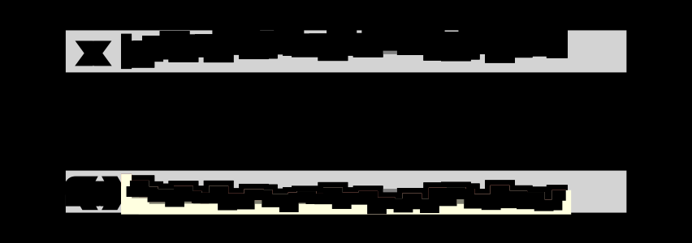
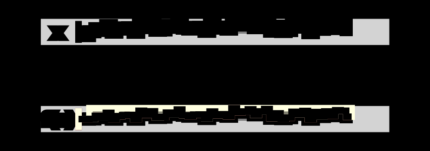
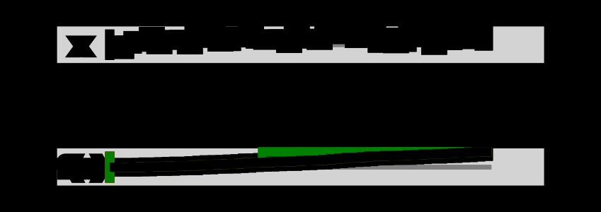
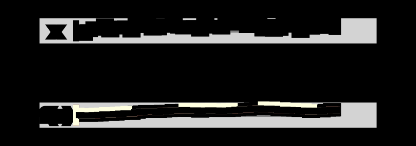
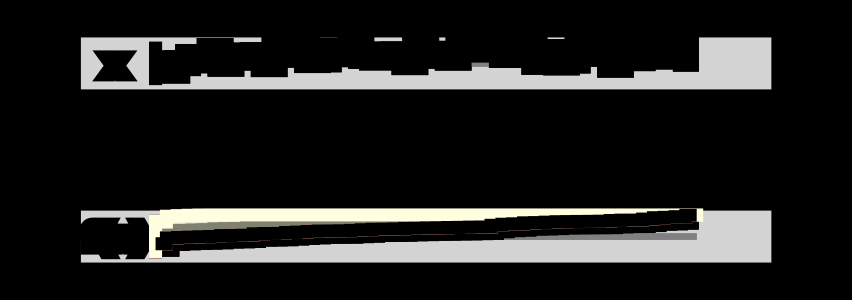

# Autodiff Puzzles
- by [Sasha Rush](http://rush-nlp.com) - [srush_nlp](https://twitter.com/srush_nlp)


This notebook contains a series of self-contained puzzles for learning about derivatives in tensor libraries. It is the 3rd puzzle set in a series of puzzles about deep learning programming ([Tensor Puzzles](https://github.com/srush/Tensor-Puzzles), [GPU Puzzles](https://github.com/srush/GPU-Puzzles) ) . While related in spirit, the puzzles are all pretty seperate and can be done on their own. 


[](https://colab.research.google.com/github/srush/Autodiff-Puzzles/blob/main/autodiff_puzzlers.ipynb)


## Introduction

Deep learning libraries like PyTorch utilize autodifferentiation of tensors to compute the parameter updates necessary to learn complex models from data. This technique is central to understanding why deep learning has become so widely used and effective. The autodifferentiation process is a neat trick that builds up a computational graph and then uses that graph to provide derivatives for user-constructed mathematical functions. At heart, this process is just an instantiation of the chain-rule based on implementations of every function and its derivative. 

However, a library *needs* to have efficient implementations of derivatives for its key building blocks. This sounds trivial -> just implement high school calculus. However, this is a bit more tricky than it sounds. Tensor-to-tensor functions are pretty complex and require keeping careful track of indexing on both the input and the output side. 

Your goal in these puzzles is to implement the derivatives for each function below. In each case the function takes in a tensor x and returns a tensor f(x), so your job is to compute $\frac{d f(x)_o}{dx_i}$ for all indices $o$ and $i$. If you get discouraged, just remember, you did this in high school (it just had way less indexing).

## Rules and Tips

* Every answer is 1 line of 80-column code. 
* Everything in these puzzles should be done with standard Python numbers. (No need for torch or anything else.)
* Recall the basic multivariate calculus identities, most importantly: 
$$f(x_1, x_2, x_3) = x_1 + x_2 + x_3 \Rightarrow \frac{d f(x)_1}{dx_1} = 1, \frac{d f(x)_1}{dx_2} = 0$$

* Python booleans auto-cast with python numbers. So you can use them as indicator functions, i.e. $$\mathbf{1}(3=3) \cdot (25-3)$$


```python
(3==3) * (25- 3)
```


    22


```python
# Library code - SKIP ME
!pip install -qqq git+https://github.com/chalk-diagrams/chalk
!wget -q https://github.com/srush/GPU-Puzzles/raw/main/robot.png https://github.com/srush/GPU-Puzzles/raw/main/lib.py

import torch
import sys
sys.setrecursionlimit(10000)
from lib import *
```


For each of the problems, a function $f$ is provided. Your job is to compute the derivative $\frac{df(x)_o} {dx_i}$. This is done by filling in the function for the `dx` variable. If you get any of the derivatives wrong, it will print out the values of $o$ and $i$ that you need to fix. Correct derivatives will be shown in orange, whereas incorrect (non-zero) derivatives will show up as red. The target differential is shown as a light grey on the graphic.

### Problem 1: Id

Warmup: $f(x_1) = x_1$


```python
def fb_id(x):
    f = lambda o: x
    dx = lambda i, o: 0 # Fill in this line
    return f, dx
in_out(fb_id, overlap=False, y=gy[1:2], out_shape=1)
```

    Errors


<div>
<style scoped>
    .dataframe tbody tr th:only-of-type {
        vertical-align: middle;
    }

    .dataframe tbody tr th {
        vertical-align: top;
    }

    .dataframe thead th {
        text-align: right;
    }
</style>
<table border="1" class="dataframe">
  <thead>
    <tr style="text-align: right;">
      <th></th>
      <th>In Index</th>
      <th>Out Index</th>
    </tr>
  </thead>
  <tbody>
    <tr>
      <th>0</th>
      <td>0</td>
      <td>0</td>
    </tr>
  </tbody>
</table>
</div>


    

    


### Problem 2: Cosine

Warmup: $f(x_1) = \cos(x_1)$


```python
def fb_cos(x):
    f = lambda o: math.cos(x)
    dx = lambda i, o: 0 # Fill in this line
    return f, dx
in_out(fb_cos, overlap=False, y=gy[1:2], out_shape=1)
```

    Errors


<div>
<style scoped>
    .dataframe tbody tr th:only-of-type {
        vertical-align: middle;
    }

    .dataframe tbody tr th {
        vertical-align: top;
    }

    .dataframe thead th {
        text-align: right;
    }
</style>
<table border="1" class="dataframe">
  <thead>
    <tr style="text-align: right;">
      <th></th>
      <th>In Index</th>
      <th>Out Index</th>
    </tr>
  </thead>
  <tbody>
    <tr>
      <th>0</th>
      <td>0</td>
      <td>0</td>
    </tr>
  </tbody>
</table>
</div>


    

    


### Problem 3: Mean

$f(x_1, x_2, \ldots, x_N) = (x_1 + x_2 + \ldots + x_N) / N$


```python
def fb_mean(x):
    N = x.shape[0]
    f = lambda o: sum(x[i] for i in range(N)) / N
    dx = lambda i, o: 0 # Fill in this line
    return f, dx
in_out(fb_mean, overlap=False,  out_shape=1)
```

    Errors


<div>
<style scoped>
    .dataframe tbody tr th:only-of-type {
        vertical-align: middle;
    }

    .dataframe tbody tr th {
        vertical-align: top;
    }

    .dataframe thead th {
        text-align: right;
    }
</style>
<table border="1" class="dataframe">
  <thead>
    <tr style="text-align: right;">
      <th></th>
      <th>In Index</th>
      <th>Out Index</th>
    </tr>
  </thead>
  <tbody>
    <tr>
      <th>0</th>
      <td>0</td>
      <td>0</td>
    </tr>
    <tr>
      <th>1</th>
      <td>1</td>
      <td>0</td>
    </tr>
    <tr>
      <th>2</th>
      <td>2</td>
      <td>0</td>
    </tr>
    <tr>
      <th>3</th>
      <td>3</td>
      <td>0</td>
    </tr>
    <tr>
      <th>4</th>
      <td>4</td>
      <td>0</td>
    </tr>
    <tr>
      <th>5</th>
      <td>5</td>
      <td>0</td>
    </tr>
    <tr>
      <th>6</th>
      <td>6</td>
      <td>0</td>
    </tr>
    <tr>
      <th>7</th>
      <td>7</td>
      <td>0</td>
    </tr>
    <tr>
      <th>8</th>
      <td>8</td>
      <td>0</td>
    </tr>
    <tr>
      <th>9</th>
      <td>9</td>
      <td>0</td>
    </tr>
  </tbody>
</table>
</div>


    

    


### Problem 4: Product

$f(x_1, x_2, \ldots, x_N) = x_1  x_2  \ldots  x_N$


```python
def fb_prod(x):
    pr = torch.prod(x)
    f = lambda o: pr
    dx = lambda i, o: 0 # Fill in this line
    return f, dx
in_out(fb_prod, overlap=False,  out_shape=1)
```


    

    


### Problem 5: Repeat

$f(x_1) = [x_1, x_1,  x_1  \ldots  x_1]$


```python
def fb_repeat(x):
    f = lambda o: x
    dx = lambda i, o: 0 # Fill in this line
    return f, dx
in_out(fb_repeat, overlap=False, y=gy[1:2], out_shape=50)
```

    Errors


<div>
<style scoped>
    .dataframe tbody tr th:only-of-type {
        vertical-align: middle;
    }

    .dataframe tbody tr th {
        vertical-align: top;
    }

    .dataframe thead th {
        text-align: right;
    }
</style>
<table border="1" class="dataframe">
  <thead>
    <tr style="text-align: right;">
      <th></th>
      <th>In Index</th>
      <th>Out Index</th>
    </tr>
  </thead>
  <tbody>
    <tr>
      <th>0</th>
      <td>0</td>
      <td>0</td>
    </tr>
    <tr>
      <th>1</th>
      <td>0</td>
      <td>1</td>
    </tr>
    <tr>
      <th>2</th>
      <td>0</td>
      <td>2</td>
    </tr>
    <tr>
      <th>3</th>
      <td>0</td>
      <td>3</td>
    </tr>
    <tr>
      <th>4</th>
      <td>0</td>
      <td>4</td>
    </tr>
    <tr>
      <th>5</th>
      <td>0</td>
      <td>5</td>
    </tr>
    <tr>
      <th>6</th>
      <td>0</td>
      <td>6</td>
    </tr>
    <tr>
      <th>7</th>
      <td>0</td>
      <td>7</td>
    </tr>
    <tr>
      <th>8</th>
      <td>0</td>
      <td>8</td>
    </tr>
    <tr>
      <th>9</th>
      <td>0</td>
      <td>9</td>
    </tr>
  </tbody>
</table>
</div>


    

    


### Problem 6: Repeat and Scale

$$f(x_1) = [x_1, x_1 * 2/N,  x_1 * 3/N,  \ldots  x_N * N/N]$$


```python
def fb_repeat_scale(x):
    N = 50
    f = lambda o: x * (o / N)
    dx = lambda i, o: 0 # Fill in this line
    return f, dx
in_out(fb_repeat_scale, overlap=False, y=gy[1:2], out_shape=50)
```

    Errors


<div>
<style scoped>
    .dataframe tbody tr th:only-of-type {
        vertical-align: middle;
    }

    .dataframe tbody tr th {
        vertical-align: top;
    }

    .dataframe thead th {
        text-align: right;
    }
</style>
<table border="1" class="dataframe">
  <thead>
    <tr style="text-align: right;">
      <th></th>
      <th>In Index</th>
      <th>Out Index</th>
    </tr>
  </thead>
  <tbody>
    <tr>
      <th>0</th>
      <td>0</td>
      <td>1</td>
    </tr>
    <tr>
      <th>1</th>
      <td>0</td>
      <td>2</td>
    </tr>
    <tr>
      <th>2</th>
      <td>0</td>
      <td>3</td>
    </tr>
    <tr>
      <th>3</th>
      <td>0</td>
      <td>4</td>
    </tr>
    <tr>
      <th>4</th>
      <td>0</td>
      <td>5</td>
    </tr>
    <tr>
      <th>5</th>
      <td>0</td>
      <td>6</td>
    </tr>
    <tr>
      <th>6</th>
      <td>0</td>
      <td>7</td>
    </tr>
    <tr>
      <th>7</th>
      <td>0</td>
      <td>8</td>
    </tr>
    <tr>
      <th>8</th>
      <td>0</td>
      <td>9</td>
    </tr>
    <tr>
      <th>9</th>
      <td>0</td>
      <td>10</td>
    </tr>
  </tbody>
</table>
</div>


    

    


## Problem 7: Negation

$$f(x_1, x_2, \ldots) = [-x_1, -x_2, \ldots]$$

(Hint: remember the indicator trick, i.e. 

```python 
(a == b) * 27 # 27 if a == b else 0
```


```python
def fb_neg(x):
    f = lambda o: -x[o]
    dx = lambda i, o: 0 # Fill in this line
    return f, dx
in_out(fb_neg)
```

    Errors


<div>
<style scoped>
    .dataframe tbody tr th:only-of-type {
        vertical-align: middle;
    }

    .dataframe tbody tr th {
        vertical-align: top;
    }

    .dataframe thead th {
        text-align: right;
    }
</style>
<table border="1" class="dataframe">
  <thead>
    <tr style="text-align: right;">
      <th></th>
      <th>In Index</th>
      <th>Out Index</th>
    </tr>
  </thead>
  <tbody>
    <tr>
      <th>0</th>
      <td>0</td>
      <td>0</td>
    </tr>
    <tr>
      <th>1</th>
      <td>1</td>
      <td>1</td>
    </tr>
    <tr>
      <th>2</th>
      <td>2</td>
      <td>2</td>
    </tr>
    <tr>
      <th>3</th>
      <td>3</td>
      <td>3</td>
    </tr>
    <tr>
      <th>4</th>
      <td>4</td>
      <td>4</td>
    </tr>
    <tr>
      <th>5</th>
      <td>5</td>
      <td>5</td>
    </tr>
    <tr>
      <th>6</th>
      <td>6</td>
      <td>6</td>
    </tr>
    <tr>
      <th>7</th>
      <td>7</td>
      <td>7</td>
    </tr>
    <tr>
      <th>8</th>
      <td>8</td>
      <td>8</td>
    </tr>
    <tr>
      <th>9</th>
      <td>9</td>
      <td>9</td>
    </tr>
  </tbody>
</table>
</div>


    

    


### Problem 8: ReLU

$$f(x_1, x_2, \ldots) = [\text{relu}(x_1), \text{relu}(x_2), \ldots]$$

Recall 

$$
\text{relu}(x) = \begin{cases}
0 & x < 0 \\
x & x >= 0
\end{cases}
$$

(Note: you can ignore the not of non-differentiability at 0.)


```python
def fb_relu(x):
    f = lambda o: (x[o] > 0) * x[o] 
    dx = lambda i, o: 0 # Fill in this line
    return f, dx
in_out(fb_relu)
```

    Errors


<div>
<style scoped>
    .dataframe tbody tr th:only-of-type {
        vertical-align: middle;
    }

    .dataframe tbody tr th {
        vertical-align: top;
    }

    .dataframe thead th {
        text-align: right;
    }
</style>
<table border="1" class="dataframe">
  <thead>
    <tr style="text-align: right;">
      <th></th>
      <th>In Index</th>
      <th>Out Index</th>
    </tr>
  </thead>
  <tbody>
    <tr>
      <th>0</th>
      <td>2</td>
      <td>2</td>
    </tr>
    <tr>
      <th>1</th>
      <td>3</td>
      <td>3</td>
    </tr>
    <tr>
      <th>2</th>
      <td>4</td>
      <td>4</td>
    </tr>
    <tr>
      <th>3</th>
      <td>5</td>
      <td>5</td>
    </tr>
    <tr>
      <th>4</th>
      <td>7</td>
      <td>7</td>
    </tr>
    <tr>
      <th>5</th>
      <td>8</td>
      <td>8</td>
    </tr>
    <tr>
      <th>6</th>
      <td>9</td>
      <td>9</td>
    </tr>
    <tr>
      <th>7</th>
      <td>11</td>
      <td>11</td>
    </tr>
    <tr>
      <th>8</th>
      <td>12</td>
      <td>12</td>
    </tr>
    <tr>
      <th>9</th>
      <td>13</td>
      <td>13</td>
    </tr>
  </tbody>
</table>
</div>


    

    


### Problem 9: Index

$$f(x_1, x_2, \ldots, x_{25}) = [x_{10}, x_{11}, \ldots, x_{25}]$$


```python
def fb_index(x):
    f = lambda o: x[o+10]
    dx = lambda i, o: 0 # Fill in this line
    return f, dx
in_out(fb_index, overlap=False, out_shape=25)
```

    Errors


<div>
<style scoped>
    .dataframe tbody tr th:only-of-type {
        vertical-align: middle;
    }

    .dataframe tbody tr th {
        vertical-align: top;
    }

    .dataframe thead th {
        text-align: right;
    }
</style>
<table border="1" class="dataframe">
  <thead>
    <tr style="text-align: right;">
      <th></th>
      <th>In Index</th>
      <th>Out Index</th>
    </tr>
  </thead>
  <tbody>
    <tr>
      <th>0</th>
      <td>10</td>
      <td>0</td>
    </tr>
    <tr>
      <th>1</th>
      <td>11</td>
      <td>1</td>
    </tr>
    <tr>
      <th>2</th>
      <td>12</td>
      <td>2</td>
    </tr>
    <tr>
      <th>3</th>
      <td>13</td>
      <td>3</td>
    </tr>
    <tr>
      <th>4</th>
      <td>14</td>
      <td>4</td>
    </tr>
    <tr>
      <th>5</th>
      <td>15</td>
      <td>5</td>
    </tr>
    <tr>
      <th>6</th>
      <td>16</td>
      <td>6</td>
    </tr>
    <tr>
      <th>7</th>
      <td>17</td>
      <td>7</td>
    </tr>
    <tr>
      <th>8</th>
      <td>18</td>
      <td>8</td>
    </tr>
    <tr>
      <th>9</th>
      <td>19</td>
      <td>9</td>
    </tr>
  </tbody>
</table>
</div>


    

    


Note: for the next several problems the visualization changes and only shows the derivatives for some points $i$ for graphical simplicity.

### Problem 9: Cumsum

$$f(x_1, x_2, \ldots) = [\sum^1_{i=1} x_{i}, \sum^2_{i=1} x_{i}, \sum^3_{i=1} x_{i}, \ldots, ] / 20$$


```python
def fb_cumsum(x):
    out = torch.cumsum(x, 0)
    f = lambda o: out[o] / 20
    dx = lambda o, i: 0 # Fill in this line
    return f, dx
in_out(fb_cumsum, [20, 35, 40], overlap=True, diff=20)
```

    Errors


<div>
<style scoped>
    .dataframe tbody tr th:only-of-type {
        vertical-align: middle;
    }

    .dataframe tbody tr th {
        vertical-align: top;
    }

    .dataframe thead th {
        text-align: right;
    }
</style>
<table border="1" class="dataframe">
  <thead>
    <tr style="text-align: right;">
      <th></th>
      <th>In Index</th>
      <th>Out Index</th>
    </tr>
  </thead>
  <tbody>
    <tr>
      <th>0</th>
      <td>0</td>
      <td>0</td>
    </tr>
    <tr>
      <th>1</th>
      <td>0</td>
      <td>1</td>
    </tr>
    <tr>
      <th>2</th>
      <td>1</td>
      <td>1</td>
    </tr>
    <tr>
      <th>3</th>
      <td>0</td>
      <td>2</td>
    </tr>
    <tr>
      <th>4</th>
      <td>1</td>
      <td>2</td>
    </tr>
    <tr>
      <th>5</th>
      <td>2</td>
      <td>2</td>
    </tr>
    <tr>
      <th>6</th>
      <td>0</td>
      <td>3</td>
    </tr>
    <tr>
      <th>7</th>
      <td>1</td>
      <td>3</td>
    </tr>
    <tr>
      <th>8</th>
      <td>2</td>
      <td>3</td>
    </tr>
    <tr>
      <th>9</th>
      <td>3</td>
      <td>3</td>
    </tr>
  </tbody>
</table>
</div>


    

    


### Problem 10: Running Mean


$$f(x_1, x_2, \ldots)_o = \frac{\displaystyle \sum^o_{i=\max(o-W, 1)} x_i}{ W}$$


```python
def fb_running(x):
    W = 10
    f = lambda o: sum([x[o-do] for do in range(W) if o-do >= 0]) / W
    dx = lambda i, o: 0 # Fill in this line
    return f, dx

in_out(fb_running, [0, 20, 35], diff=4)
```

    Errors


<div>
<style scoped>
    .dataframe tbody tr th:only-of-type {
        vertical-align: middle;
    }

    .dataframe tbody tr th {
        vertical-align: top;
    }

    .dataframe thead th {
        text-align: right;
    }
</style>
<table border="1" class="dataframe">
  <thead>
    <tr style="text-align: right;">
      <th></th>
      <th>In Index</th>
      <th>Out Index</th>
    </tr>
  </thead>
  <tbody>
    <tr>
      <th>0</th>
      <td>0</td>
      <td>0</td>
    </tr>
    <tr>
      <th>1</th>
      <td>0</td>
      <td>1</td>
    </tr>
    <tr>
      <th>2</th>
      <td>1</td>
      <td>1</td>
    </tr>
    <tr>
      <th>3</th>
      <td>0</td>
      <td>2</td>
    </tr>
    <tr>
      <th>4</th>
      <td>1</td>
      <td>2</td>
    </tr>
    <tr>
      <th>5</th>
      <td>2</td>
      <td>2</td>
    </tr>
    <tr>
      <th>6</th>
      <td>0</td>
      <td>3</td>
    </tr>
    <tr>
      <th>7</th>
      <td>1</td>
      <td>3</td>
    </tr>
    <tr>
      <th>8</th>
      <td>2</td>
      <td>3</td>
    </tr>
    <tr>
      <th>9</th>
      <td>3</td>
      <td>3</td>
    </tr>
  </tbody>
</table>
</div>


    

    


### Problem 11: Sort


$$f(x_1, x_2, \ldots) = \text{x's in sorted order}$$

(This one is a bit counterintuitive! Note that we are not asking you to differentiate the sorting function it self.)


```python
def fb_sort(x):
    sort, argsort = torch.sort(x, 0)
    f = lambda o: sort[o]
    dx = lambda i, o: 0 # Fill in this line
    return f, dx
in_out(fb_sort, overlap=False)
```

    Errors


<div>
<style scoped>
    .dataframe tbody tr th:only-of-type {
        vertical-align: middle;
    }

    .dataframe tbody tr th {
        vertical-align: top;
    }

    .dataframe thead th {
        text-align: right;
    }
</style>
<table border="1" class="dataframe">
  <thead>
    <tr style="text-align: right;">
      <th></th>
      <th>In Index</th>
      <th>Out Index</th>
    </tr>
  </thead>
  <tbody>
    <tr>
      <th>0</th>
      <td>1</td>
      <td>0</td>
    </tr>
    <tr>
      <th>1</th>
      <td>42</td>
      <td>1</td>
    </tr>
    <tr>
      <th>2</th>
      <td>10</td>
      <td>2</td>
    </tr>
    <tr>
      <th>3</th>
      <td>6</td>
      <td>3</td>
    </tr>
    <tr>
      <th>4</th>
      <td>0</td>
      <td>4</td>
    </tr>
    <tr>
      <th>5</th>
      <td>2</td>
      <td>5</td>
    </tr>
    <tr>
      <th>6</th>
      <td>37</td>
      <td>6</td>
    </tr>
    <tr>
      <th>7</th>
      <td>23</td>
      <td>7</td>
    </tr>
    <tr>
      <th>8</th>
      <td>35</td>
      <td>8</td>
    </tr>
    <tr>
      <th>9</th>
      <td>38</td>
      <td>9</td>
    </tr>
  </tbody>
</table>
</div>


    

    


Next we move on to functions of two arguments. For these you will produce two derivatives: $$\frac{df(x, y)_o}{x_i}, \frac{df(x, y)_o}{y_j}$$. Everything else is the same.

### Problem 12: Elementwise mean

$$f(x, y)_o = (x_o + y_o) /2 $$


```python
def fb_emean(x, y):
    f = lambda o: (x[o] + y[o]) / 2
    dx = lambda i, o: 0 # Fill in this line
    dy = lambda j, o: 0 # Fill in this line
    return f, dx, dy
zip(fb_emean)
```

    2
    x Errors


<div>
<style scoped>
    .dataframe tbody tr th:only-of-type {
        vertical-align: middle;
    }

    .dataframe tbody tr th {
        vertical-align: top;
    }

    .dataframe thead th {
        text-align: right;
    }
</style>
<table border="1" class="dataframe">
  <thead>
    <tr style="text-align: right;">
      <th></th>
      <th>In Index</th>
      <th>Out Index</th>
    </tr>
  </thead>
  <tbody>
    <tr>
      <th>0</th>
      <td>0</td>
      <td>0</td>
    </tr>
    <tr>
      <th>1</th>
      <td>1</td>
      <td>1</td>
    </tr>
    <tr>
      <th>2</th>
      <td>2</td>
      <td>2</td>
    </tr>
    <tr>
      <th>3</th>
      <td>3</td>
      <td>3</td>
    </tr>
    <tr>
      <th>4</th>
      <td>4</td>
      <td>4</td>
    </tr>
    <tr>
      <th>5</th>
      <td>5</td>
      <td>5</td>
    </tr>
    <tr>
      <th>6</th>
      <td>6</td>
      <td>6</td>
    </tr>
    <tr>
      <th>7</th>
      <td>7</td>
      <td>7</td>
    </tr>
    <tr>
      <th>8</th>
      <td>8</td>
      <td>8</td>
    </tr>
    <tr>
      <th>9</th>
      <td>9</td>
      <td>9</td>
    </tr>
  </tbody>
</table>
</div>


    y Errors


<div>
<style scoped>
    .dataframe tbody tr th:only-of-type {
        vertical-align: middle;
    }

    .dataframe tbody tr th {
        vertical-align: top;
    }

    .dataframe thead th {
        text-align: right;
    }
</style>
<table border="1" class="dataframe">
  <thead>
    <tr style="text-align: right;">
      <th></th>
      <th>In Index</th>
      <th>Out Index</th>
    </tr>
  </thead>
  <tbody>
    <tr>
      <th>0</th>
      <td>0</td>
      <td>0</td>
    </tr>
    <tr>
      <th>1</th>
      <td>1</td>
      <td>1</td>
    </tr>
    <tr>
      <th>2</th>
      <td>2</td>
      <td>2</td>
    </tr>
    <tr>
      <th>3</th>
      <td>3</td>
      <td>3</td>
    </tr>
    <tr>
      <th>4</th>
      <td>4</td>
      <td>4</td>
    </tr>
    <tr>
      <th>5</th>
      <td>5</td>
      <td>5</td>
    </tr>
    <tr>
      <th>6</th>
      <td>6</td>
      <td>6</td>
    </tr>
    <tr>
      <th>7</th>
      <td>7</td>
      <td>7</td>
    </tr>
    <tr>
      <th>8</th>
      <td>8</td>
      <td>8</td>
    </tr>
    <tr>
      <th>9</th>
      <td>9</td>
      <td>9</td>
    </tr>
  </tbody>
</table>
</div>


    

    


### Problem 13: Elementwise mul

$$f(x, y)_o = x_o * y_o $$


```python
def fb_mul(x, y):
    f = lambda o: x[o] * y[o]
    dx = lambda i, o: 0 # Fill in this line
    dy = lambda j, o: 0 # Fill in this line
    return f, dx, dy

zip(fb_mul)
```

    2
    x Errors


<div>
<style scoped>
    .dataframe tbody tr th:only-of-type {
        vertical-align: middle;
    }

    .dataframe tbody tr th {
        vertical-align: top;
    }

    .dataframe thead th {
        text-align: right;
    }
</style>
<table border="1" class="dataframe">
  <thead>
    <tr style="text-align: right;">
      <th></th>
      <th>In Index</th>
      <th>Out Index</th>
    </tr>
  </thead>
  <tbody>
    <tr>
      <th>0</th>
      <td>0</td>
      <td>0</td>
    </tr>
    <tr>
      <th>1</th>
      <td>1</td>
      <td>1</td>
    </tr>
    <tr>
      <th>2</th>
      <td>2</td>
      <td>2</td>
    </tr>
    <tr>
      <th>3</th>
      <td>3</td>
      <td>3</td>
    </tr>
    <tr>
      <th>4</th>
      <td>4</td>
      <td>4</td>
    </tr>
    <tr>
      <th>5</th>
      <td>5</td>
      <td>5</td>
    </tr>
    <tr>
      <th>6</th>
      <td>6</td>
      <td>6</td>
    </tr>
    <tr>
      <th>7</th>
      <td>7</td>
      <td>7</td>
    </tr>
    <tr>
      <th>8</th>
      <td>8</td>
      <td>8</td>
    </tr>
    <tr>
      <th>9</th>
      <td>9</td>
      <td>9</td>
    </tr>
  </tbody>
</table>
</div>


    y Errors


<div>
<style scoped>
    .dataframe tbody tr th:only-of-type {
        vertical-align: middle;
    }

    .dataframe tbody tr th {
        vertical-align: top;
    }

    .dataframe thead th {
        text-align: right;
    }
</style>
<table border="1" class="dataframe">
  <thead>
    <tr style="text-align: right;">
      <th></th>
      <th>In Index</th>
      <th>Out Index</th>
    </tr>
  </thead>
  <tbody>
    <tr>
      <th>0</th>
      <td>1</td>
      <td>1</td>
    </tr>
    <tr>
      <th>1</th>
      <td>2</td>
      <td>2</td>
    </tr>
    <tr>
      <th>2</th>
      <td>3</td>
      <td>3</td>
    </tr>
    <tr>
      <th>3</th>
      <td>4</td>
      <td>4</td>
    </tr>
    <tr>
      <th>4</th>
      <td>5</td>
      <td>5</td>
    </tr>
    <tr>
      <th>5</th>
      <td>6</td>
      <td>6</td>
    </tr>
    <tr>
      <th>6</th>
      <td>7</td>
      <td>7</td>
    </tr>
    <tr>
      <th>7</th>
      <td>8</td>
      <td>8</td>
    </tr>
    <tr>
      <th>8</th>
      <td>9</td>
      <td>9</td>
    </tr>
    <tr>
      <th>9</th>
      <td>10</td>
      <td>10</td>
    </tr>
  </tbody>
</table>
</div>


    

    


### Problem 14: 1D Convolution

This is the standard 1D convolution used in deep learning. There is no wrap-around.

$$f(x, y)_o = \sum_{j=1}^K x_{o+j} * y_{j} / K $$

Note: This is probably the hardest one. The answer is short but tricky.


```python
def fb_conv(x, y):
    W = 5
    f = lambda o: sum((x[o + j] * y[j]) / W for j in range(W))
    dx = lambda i, o: 0 # Fill in this line
    dy = lambda j, o: 0 # Fill in this line
    return f, dx, dy

SHOW_KERNEL = False
zip(fb_conv, split=45, out_shape=39, pos1=[10, 20, 30], pos2=[5] if SHOW_KERNEL else [], 
    diff=5, overlap=True)
```

    2
    x Errors


<div>
<style scoped>
    .dataframe tbody tr th:only-of-type {
        vertical-align: middle;
    }

    .dataframe tbody tr th {
        vertical-align: top;
    }

    .dataframe thead th {
        text-align: right;
    }
</style>
<table border="1" class="dataframe">
  <thead>
    <tr style="text-align: right;">
      <th></th>
      <th>In Index</th>
      <th>Out Index</th>
    </tr>
  </thead>
  <tbody>
    <tr>
      <th>0</th>
      <td>0</td>
      <td>0</td>
    </tr>
    <tr>
      <th>1</th>
      <td>1</td>
      <td>0</td>
    </tr>
    <tr>
      <th>2</th>
      <td>2</td>
      <td>0</td>
    </tr>
    <tr>
      <th>3</th>
      <td>3</td>
      <td>0</td>
    </tr>
    <tr>
      <th>4</th>
      <td>4</td>
      <td>0</td>
    </tr>
    <tr>
      <th>5</th>
      <td>1</td>
      <td>1</td>
    </tr>
    <tr>
      <th>6</th>
      <td>2</td>
      <td>1</td>
    </tr>
    <tr>
      <th>7</th>
      <td>3</td>
      <td>1</td>
    </tr>
    <tr>
      <th>8</th>
      <td>4</td>
      <td>1</td>
    </tr>
    <tr>
      <th>9</th>
      <td>5</td>
      <td>1</td>
    </tr>
  </tbody>
</table>
</div>


    y Errors


<div>
<style scoped>
    .dataframe tbody tr th:only-of-type {
        vertical-align: middle;
    }

    .dataframe tbody tr th {
        vertical-align: top;
    }

    .dataframe thead th {
        text-align: right;
    }
</style>
<table border="1" class="dataframe">
  <thead>
    <tr style="text-align: right;">
      <th></th>
      <th>In Index</th>
      <th>Out Index</th>
    </tr>
  </thead>
  <tbody>
    <tr>
      <th>0</th>
      <td>1</td>
      <td>0</td>
    </tr>
    <tr>
      <th>1</th>
      <td>3</td>
      <td>0</td>
    </tr>
    <tr>
      <th>2</th>
      <td>4</td>
      <td>0</td>
    </tr>
    <tr>
      <th>3</th>
      <td>0</td>
      <td>1</td>
    </tr>
    <tr>
      <th>4</th>
      <td>2</td>
      <td>1</td>
    </tr>
    <tr>
      <th>5</th>
      <td>3</td>
      <td>1</td>
    </tr>
    <tr>
      <th>6</th>
      <td>4</td>
      <td>1</td>
    </tr>
    <tr>
      <th>7</th>
      <td>1</td>
      <td>2</td>
    </tr>
    <tr>
      <th>8</th>
      <td>2</td>
      <td>2</td>
    </tr>
    <tr>
      <th>9</th>
      <td>3</td>
      <td>2</td>
    </tr>
  </tbody>
</table>
</div>


    

    


For these next problems, the input is a matrix and an optional vector, and the output is a matrix.

$$\frac{df(x, y)_{o, p}}{x_{i, j}}, \frac{df(x, y)_{o,p}}{y_j}$$

For visual simplicity results are shown on the flattened version of these matrices.

## Problem 15: View

Compute the identity function for all $o,p$. $Y$ is ignored.

$$f(X, Y)_{o, p} = X_{o, p}$$


```python
def fb_view(x, y):
    f = lambda o, p: x[o, p]
    dx = lambda i, j, o, p: 0 # Fill in this line
    dy = lambda j, o, p: 0 # Fill in this line
    return f, dx, dy

zip(make_mat(fb_view, (4, 10), (4, 10)), split=40, out_shape=40, gaps=[10 * i for i in range(4)])
```

    5
    x Errors


<div>
<style scoped>
    .dataframe tbody tr th:only-of-type {
        vertical-align: middle;
    }

    .dataframe tbody tr th {
        vertical-align: top;
    }

    .dataframe thead th {
        text-align: right;
    }
</style>
<table border="1" class="dataframe">
  <thead>
    <tr style="text-align: right;">
      <th></th>
      <th>In Index</th>
      <th>Out Index</th>
    </tr>
  </thead>
  <tbody>
    <tr>
      <th>0</th>
      <td>0</td>
      <td>0</td>
    </tr>
    <tr>
      <th>1</th>
      <td>1</td>
      <td>1</td>
    </tr>
    <tr>
      <th>2</th>
      <td>2</td>
      <td>2</td>
    </tr>
    <tr>
      <th>3</th>
      <td>3</td>
      <td>3</td>
    </tr>
    <tr>
      <th>4</th>
      <td>4</td>
      <td>4</td>
    </tr>
    <tr>
      <th>5</th>
      <td>5</td>
      <td>5</td>
    </tr>
    <tr>
      <th>6</th>
      <td>6</td>
      <td>6</td>
    </tr>
    <tr>
      <th>7</th>
      <td>7</td>
      <td>7</td>
    </tr>
    <tr>
      <th>8</th>
      <td>8</td>
      <td>8</td>
    </tr>
    <tr>
      <th>9</th>
      <td>9</td>
      <td>9</td>
    </tr>
  </tbody>
</table>
</div>


    

    


### Problem 16: Transpose

Transpose row and columns

$$f(X, Y)_{o, p} = X_{p, o}$$


```python
def fb_trans(x, y):
    f = lambda o, p: x[p, o]
    dx = lambda i, j, o, p: 0 # Fill in this line
    dy = lambda j, o, p: 0 # Fill in this line
    return f, dx, dy
zip(make_mat(fb_trans,  in_shape=(4, 10), out_shape=(10, 4)), split=40, out_shape=40, gaps=[10 * i for i in range(4)])
```

    5
    x Errors


<div>
<style scoped>
    .dataframe tbody tr th:only-of-type {
        vertical-align: middle;
    }

    .dataframe tbody tr th {
        vertical-align: top;
    }

    .dataframe thead th {
        text-align: right;
    }
</style>
<table border="1" class="dataframe">
  <thead>
    <tr style="text-align: right;">
      <th></th>
      <th>In Index</th>
      <th>Out Index</th>
    </tr>
  </thead>
  <tbody>
    <tr>
      <th>0</th>
      <td>0</td>
      <td>0</td>
    </tr>
    <tr>
      <th>1</th>
      <td>10</td>
      <td>1</td>
    </tr>
    <tr>
      <th>2</th>
      <td>20</td>
      <td>2</td>
    </tr>
    <tr>
      <th>3</th>
      <td>30</td>
      <td>3</td>
    </tr>
    <tr>
      <th>4</th>
      <td>1</td>
      <td>4</td>
    </tr>
    <tr>
      <th>5</th>
      <td>11</td>
      <td>5</td>
    </tr>
    <tr>
      <th>6</th>
      <td>21</td>
      <td>6</td>
    </tr>
    <tr>
      <th>7</th>
      <td>31</td>
      <td>7</td>
    </tr>
    <tr>
      <th>8</th>
      <td>2</td>
      <td>8</td>
    </tr>
    <tr>
      <th>9</th>
      <td>12</td>
      <td>9</td>
    </tr>
  </tbody>
</table>
</div>


    

    


### Problem 17: Broadcast 

Broadcast a matrix with a vector

$$f(X, y)_{o, p} = X_{o, p} \cdot y_p$$


```python
def fb_broad(x, y):
    f = lambda o, p: x[o, p] * y[p]
    dx = lambda i, j, o, p: 0 # Fill in this line
    dy = lambda j, o, p: 0 # Fill in this line
    return f, dx, dy
zip(make_mat(fb_broad,  in_shape=(4, 10), out_shape=(4, 10)), split=40, out_shape=40, gaps=[10 * i for i in range(4)])
```

    5
    x Errors


<div>
<style scoped>
    .dataframe tbody tr th:only-of-type {
        vertical-align: middle;
    }

    .dataframe tbody tr th {
        vertical-align: top;
    }

    .dataframe thead th {
        text-align: right;
    }
</style>
<table border="1" class="dataframe">
  <thead>
    <tr style="text-align: right;">
      <th></th>
      <th>In Index</th>
      <th>Out Index</th>
    </tr>
  </thead>
  <tbody>
    <tr>
      <th>0</th>
      <td>0</td>
      <td>0</td>
    </tr>
    <tr>
      <th>1</th>
      <td>1</td>
      <td>1</td>
    </tr>
    <tr>
      <th>2</th>
      <td>2</td>
      <td>2</td>
    </tr>
    <tr>
      <th>3</th>
      <td>3</td>
      <td>3</td>
    </tr>
    <tr>
      <th>4</th>
      <td>4</td>
      <td>4</td>
    </tr>
    <tr>
      <th>5</th>
      <td>5</td>
      <td>5</td>
    </tr>
    <tr>
      <th>6</th>
      <td>6</td>
      <td>6</td>
    </tr>
    <tr>
      <th>7</th>
      <td>7</td>
      <td>7</td>
    </tr>
    <tr>
      <th>8</th>
      <td>8</td>
      <td>8</td>
    </tr>
    <tr>
      <th>9</th>
      <td>9</td>
      <td>9</td>
    </tr>
  </tbody>
</table>
</div>


    y Errors


<div>
<style scoped>
    .dataframe tbody tr th:only-of-type {
        vertical-align: middle;
    }

    .dataframe tbody tr th {
        vertical-align: top;
    }

    .dataframe thead th {
        text-align: right;
    }
</style>
<table border="1" class="dataframe">
  <thead>
    <tr style="text-align: right;">
      <th></th>
      <th>In Index</th>
      <th>Out Index</th>
    </tr>
  </thead>
  <tbody>
    <tr>
      <th>0</th>
      <td>1</td>
      <td>1</td>
    </tr>
    <tr>
      <th>1</th>
      <td>2</td>
      <td>2</td>
    </tr>
    <tr>
      <th>2</th>
      <td>3</td>
      <td>3</td>
    </tr>
    <tr>
      <th>3</th>
      <td>4</td>
      <td>4</td>
    </tr>
    <tr>
      <th>4</th>
      <td>5</td>
      <td>5</td>
    </tr>
    <tr>
      <th>5</th>
      <td>6</td>
      <td>6</td>
    </tr>
    <tr>
      <th>6</th>
      <td>7</td>
      <td>7</td>
    </tr>
    <tr>
      <th>7</th>
      <td>8</td>
      <td>8</td>
    </tr>
    <tr>
      <th>8</th>
      <td>9</td>
      <td>9</td>
    </tr>
    <tr>
      <th>9</th>
      <td>0</td>
      <td>10</td>
    </tr>
  </tbody>
</table>
</div>


    

    


### Problem 18: Mean Reduce

Compute the mean over rows

$$f(X, y)_{o, p} = \sum_{i} X_{i, p} / R$$


```python
def fb_mean(x, y):
    R = x.shape[0]
    f = lambda o, p: sum(x[di, p] for di in range(R)) / R
    dx = lambda i, j, o, p: 0 # Fill in this line
    dy = lambda j, o, p: 0 # Fill in this line
    return f, dx, dy
zip(make_mat(fb_mean,  in_shape=(4, 10), out_shape=(1, 10)), 
    split=40, out_shape=10, gaps=[10 * i for i in range(4)])
```

    5
    x Errors


<div>
<style scoped>
    .dataframe tbody tr th:only-of-type {
        vertical-align: middle;
    }

    .dataframe tbody tr th {
        vertical-align: top;
    }

    .dataframe thead th {
        text-align: right;
    }
</style>
<table border="1" class="dataframe">
  <thead>
    <tr style="text-align: right;">
      <th></th>
      <th>In Index</th>
      <th>Out Index</th>
    </tr>
  </thead>
  <tbody>
    <tr>
      <th>0</th>
      <td>0</td>
      <td>0</td>
    </tr>
    <tr>
      <th>1</th>
      <td>10</td>
      <td>0</td>
    </tr>
    <tr>
      <th>2</th>
      <td>20</td>
      <td>0</td>
    </tr>
    <tr>
      <th>3</th>
      <td>30</td>
      <td>0</td>
    </tr>
    <tr>
      <th>4</th>
      <td>1</td>
      <td>1</td>
    </tr>
    <tr>
      <th>5</th>
      <td>11</td>
      <td>1</td>
    </tr>
    <tr>
      <th>6</th>
      <td>21</td>
      <td>1</td>
    </tr>
    <tr>
      <th>7</th>
      <td>31</td>
      <td>1</td>
    </tr>
    <tr>
      <th>8</th>
      <td>2</td>
      <td>2</td>
    </tr>
    <tr>
      <th>9</th>
      <td>12</td>
      <td>2</td>
    </tr>
  </tbody>
</table>
</div>


    

    


### Problem 19: Matmul

Standard matrix multiplication

$$f(X, Y)_{o,p} = \sum_j X_{o, j} Y_{j,p}$$


```python
def fb_mm(x, y):
    _, M = x.shape
    f = lambda o, p: sum(x[o, d] * y[d, p] for d in range(M)) / M 
    dx = lambda i, j, o, p: 0 # Fill in this line
    dy = lambda i, j, o, p: 0 # Fill in this line
    return f, dx, dy

zip(make_mat2(fb_mm,  in_shape=(5, 5), in_shape2=(5, 5), out_shape=(5, 5)), 
    split=25, out_shape=25, gaps=[5 * i for i in range(5)],  
    pos1=None, pos2=None)
```

    6
    x Errors


<div>
<style scoped>
    .dataframe tbody tr th:only-of-type {
        vertical-align: middle;
    }

    .dataframe tbody tr th {
        vertical-align: top;
    }

    .dataframe thead th {
        text-align: right;
    }
</style>
<table border="1" class="dataframe">
  <thead>
    <tr style="text-align: right;">
      <th></th>
      <th>In Index</th>
      <th>Out Index</th>
    </tr>
  </thead>
  <tbody>
    <tr>
      <th>0</th>
      <td>0</td>
      <td>0</td>
    </tr>
    <tr>
      <th>1</th>
      <td>1</td>
      <td>0</td>
    </tr>
    <tr>
      <th>2</th>
      <td>2</td>
      <td>0</td>
    </tr>
    <tr>
      <th>3</th>
      <td>3</td>
      <td>0</td>
    </tr>
    <tr>
      <th>4</th>
      <td>4</td>
      <td>0</td>
    </tr>
    <tr>
      <th>5</th>
      <td>0</td>
      <td>1</td>
    </tr>
    <tr>
      <th>6</th>
      <td>1</td>
      <td>1</td>
    </tr>
    <tr>
      <th>7</th>
      <td>2</td>
      <td>1</td>
    </tr>
    <tr>
      <th>8</th>
      <td>3</td>
      <td>1</td>
    </tr>
    <tr>
      <th>9</th>
      <td>4</td>
      <td>1</td>
    </tr>
  </tbody>
</table>
</div>


    y Errors


<div>
<style scoped>
    .dataframe tbody tr th:only-of-type {
        vertical-align: middle;
    }

    .dataframe tbody tr th {
        vertical-align: top;
    }

    .dataframe thead th {
        text-align: right;
    }
</style>
<table border="1" class="dataframe">
  <thead>
    <tr style="text-align: right;">
      <th></th>
      <th>In Index</th>
      <th>Out Index</th>
    </tr>
  </thead>
  <tbody>
    <tr>
      <th>0</th>
      <td>5</td>
      <td>0</td>
    </tr>
    <tr>
      <th>1</th>
      <td>15</td>
      <td>0</td>
    </tr>
    <tr>
      <th>2</th>
      <td>20</td>
      <td>0</td>
    </tr>
    <tr>
      <th>3</th>
      <td>6</td>
      <td>1</td>
    </tr>
    <tr>
      <th>4</th>
      <td>16</td>
      <td>1</td>
    </tr>
    <tr>
      <th>5</th>
      <td>21</td>
      <td>1</td>
    </tr>
    <tr>
      <th>6</th>
      <td>7</td>
      <td>2</td>
    </tr>
    <tr>
      <th>7</th>
      <td>17</td>
      <td>2</td>
    </tr>
    <tr>
      <th>8</th>
      <td>22</td>
      <td>2</td>
    </tr>
    <tr>
      <th>9</th>
      <td>8</td>
      <td>3</td>
    </tr>
  </tbody>
</table>
</div>


    

    


### Problem 20: 2D Conv

Two Dimensional convolution

$$f(X, Y)_{o,p} = \sum_{dh}\sum_{dw} X_{o+dh, p+dw} Y_{dh,dw}$$


```python
def fb_conv(x, y):
    kh, kw = y.shape
    f = lambda o, p: sum(x[o + di, p + dj] * y[di, dj] / (kh * kw)
                         for di in range(kh) for dj in range(kw)) 
    dx = lambda i, j, o, p: 0 # Fill in this line
    dy = lambda i, j, o, p: 0 # Fill in this line
    return f, dx, dy

zip(make_mat2(fb_conv,  in_shape=(7, 7), in_shape2=(3, 3), out_shape=(5, 5)), 
    split=49, out_shape=25, gaps=[7 * i for i in range(7)], 
    y=torch.cat(2*[gy.abs() + 0.2],0)[:58], 
    pos1=[23, 36], pos2=[])
```

    8
    x Errors


<div>
<style scoped>
    .dataframe tbody tr th:only-of-type {
        vertical-align: middle;
    }

    .dataframe tbody tr th {
        vertical-align: top;
    }

    .dataframe thead th {
        text-align: right;
    }
</style>
<table border="1" class="dataframe">
  <thead>
    <tr style="text-align: right;">
      <th></th>
      <th>In Index</th>
      <th>Out Index</th>
    </tr>
  </thead>
  <tbody>
    <tr>
      <th>0</th>
      <td>0</td>
      <td>0</td>
    </tr>
    <tr>
      <th>1</th>
      <td>1</td>
      <td>0</td>
    </tr>
    <tr>
      <th>2</th>
      <td>2</td>
      <td>0</td>
    </tr>
    <tr>
      <th>3</th>
      <td>7</td>
      <td>0</td>
    </tr>
    <tr>
      <th>4</th>
      <td>8</td>
      <td>0</td>
    </tr>
    <tr>
      <th>5</th>
      <td>9</td>
      <td>0</td>
    </tr>
    <tr>
      <th>6</th>
      <td>14</td>
      <td>0</td>
    </tr>
    <tr>
      <th>7</th>
      <td>15</td>
      <td>0</td>
    </tr>
    <tr>
      <th>8</th>
      <td>16</td>
      <td>0</td>
    </tr>
    <tr>
      <th>9</th>
      <td>1</td>
      <td>1</td>
    </tr>
  </tbody>
</table>
</div>


    y Errors


<div>
<style scoped>
    .dataframe tbody tr th:only-of-type {
        vertical-align: middle;
    }

    .dataframe tbody tr th {
        vertical-align: top;
    }

    .dataframe thead th {
        text-align: right;
    }
</style>
<table border="1" class="dataframe">
  <thead>
    <tr style="text-align: right;">
      <th></th>
      <th>In Index</th>
      <th>Out Index</th>
    </tr>
  </thead>
  <tbody>
    <tr>
      <th>0</th>
      <td>0</td>
      <td>0</td>
    </tr>
    <tr>
      <th>1</th>
      <td>1</td>
      <td>0</td>
    </tr>
    <tr>
      <th>2</th>
      <td>2</td>
      <td>0</td>
    </tr>
    <tr>
      <th>3</th>
      <td>3</td>
      <td>0</td>
    </tr>
    <tr>
      <th>4</th>
      <td>4</td>
      <td>0</td>
    </tr>
    <tr>
      <th>5</th>
      <td>5</td>
      <td>0</td>
    </tr>
    <tr>
      <th>6</th>
      <td>6</td>
      <td>0</td>
    </tr>
    <tr>
      <th>7</th>
      <td>7</td>
      <td>0</td>
    </tr>
    <tr>
      <th>8</th>
      <td>8</td>
      <td>0</td>
    </tr>
    <tr>
      <th>9</th>
      <td>0</td>
      <td>1</td>
    </tr>
  </tbody>
</table>
</div>


    

    


